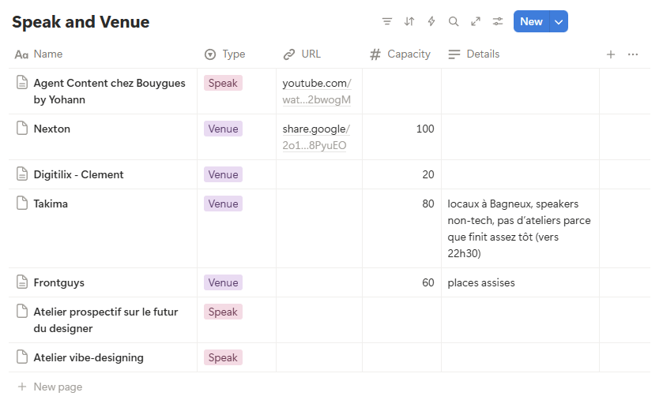

*Initiative “IA pour (tout) le monde” · 2026 - Nicolas Chatelain*

---

## Comment lire ce guide

Ce playbook est écrit pour que vous puissiez organiser un événement de l’initiative **“AI pour (tout) le monde”** de manière quasi-autonome. Il est structuré en phases chronologiques, chacune avec les tâches, les points de décision, et les critères de qualité à maintenir.

Tout est fait pour rester léger. Cette initiative tourne sur notre temps libre - le playbook ne doit pas devenir une charge en soi et est libre d’interprétation.

---

*Lisez le [READ ME - Manifesto](https://www.notion.so/READ-ME-Manifesto-2f9166572cc68004b910ede8c421e3d1?pvs=21) avant de découvrir ce Playbook.*

---

## Outils à disposition



[**Contact Hub**](https://www.notion.so/2e7166572cc68066a37ed66fff801285?pvs=21) - Tableau qui centralise les speakers, les lieux, les événements passés et les contacts. Utile pour mettre en relation les contributeurs entre eux, sans que quiconque soit un goulot d'étranglement.


Télécharge-moi !

**Mascotte** - Élément de branding de l’initiative à utiliser sur les assets de communication. Vous pouvez créer des variants sur https://gemini.google.com/app


[**LinkedIn**](https://www.linkedin.com/in/nicolas-chatel1/) - Canal principal de promotion des événements. Ajoutez-moi à votre réseau !


[**Luma**](https://luma.com/home) - Création des pages d'événement et gestion des inscriptions. Chaque événement a sa propre page.

---

## Vue d'ensemble

Un événement se prépare en **6 à 8 semaines**, en 5 phases :

```
S-8 à S-4        →  Lieu + Speaker confirmés
S-4 à S-2        →  Contenu cadré, première communication
S-2 à S-0        →  Promotion active et logistique finale
J+0              →  L'événement
J+1 à J+7        →  Retour d'expérience
```

Si les choses s'accélèrent, la timeline peut se compresser - mais **lieu et speaker avant tout le reste**.

Les phases 0 (Choisir le bon l’événement, 1 (Sélectionner le lieu) et 2 (Recruter le/les speakers) sont interchangeables à convenance.

- Récapitulatif de la to-do
    
    **Phase 0**
    
    - [ ]  Choisir le niveau et le format de l’événement
    
    Phase 1
    
    - [ ]  Trouvez un espace gratuit, disponible un soir de semaine entre 18h30 et 21h.
    - [ ]  Proposer au lieu de prendre en charge le catering et/ou de proposer un speaker.
    - [ ]  Faire un échange rapide (15-20 min, en visio ou en personne) pour cadrer ensemble.
    
    Phase 2
    
    - [ ]  Trouvez un speaker qui peut montrer un workflow concret lors de l'atelier.
    
    Phase 3
    
    - [ ]  Prévoir un/des échanges rapides (15-20 min, en visio ou en personne) pour cadrer ensemble.
    - [ ]  S’assurer que ce n’est pas un talk corpo ou une publicité déguisée
    
    Phase 4
    
    - [ ]  Préparer les assets de communication en utilisant la [Mascotte](https://www.notion.so/Playbook-Organiser-un-v-nement-2f9166572cc6805eb706db103a5a1d00?pvs=21)
    - [ ]  Préparer les posts LinkedIn d’annonce
    - [ ]  Préparer la page Luma
    - [ ]  Faire valider la communication avec les stakeholders
    
    Phase 5
    
    - [ ]  Confirmer l'accès au lieu (contact du lieu, badge si nécessaire)
    - [ ]  Vérifier que la projection fonctionne
    - [ ]  Vérifier que le Wi-Fi est accessible
    - [ ]  Aider si possible à l’installation sur place
    - [ ]  Avoir des étiquettes pour les participants
    
    Phase 6
    
    - [ ]  Préparer un petit formulaire de feedback
    - [ ]  Envoyer la demande de feedback aux participants
    - [ ]  Partager le feedback à vos stakeholders
    

---

## Phase 0 - Choisir le bon événement

Deux axes de décision avant de se lancer : le **niveau** dans la progression de l'initiative, et le **format** de l'événement. Les deux déterminent le lieu, le speaker, et le déroulement.

### To-do

### Le niveau

> **Niveau 1 - Comprendre**
Aucun outil requis. Aucune installation. Format le plus accessible. *Si c'est votre premier événement : commencez ici.*
> 

> **Niveau 2 - Utiliser**
Des outils gratuits utilisés en direct en groupe (prompting, génération d'UI, benchmarking). Le speaker doit connaître ces outils dans sa pratique.
> 

> **Niveau 3 - Créer**
Vibe coding avec Cursor / Claude Code. Profil de speaker rare, niveau technique plus élevé. Ne lancez un niveau 3 qu'après avoir organisé localement au moins un niveau 1 ou 2.
> 

### Le format

Le format détermine la capacité du lieu, la disposition, et le déroulement. Deux modes :

> **Talk**
Un ou plusieurs speakers présentent en 25 min chacun.e. Pas besoin de tables, format plus classique. Capacité plus grande : **25 à 100 personnes**. **Éviter les tables rondes**. Idéal pour le niveau 1, mais fonctionne à tous les niveaux.
> 

> **Workshop**
Pratique en groupe, les participants font quelque chose ensemble. Petit comité : **15 à 30 personnes max**. Des tables par groupe si possible. Idéal pour les niveaux 2 et 3.
> 

> **Hybride**
La plupart des éditions pourront être un hybride: talk(s) de 20-25 min puis pratique en workshop pour appliquer la théorie. Dans ce cas, pensez capacité workshop.
>

### Critères de qualité de l'initiative

Ces critères sont constants, peu importe qui organise ou quel niveau d'événement :

1. **Gratuit.** Pas d'exception.
2. **Accessible.** Pas de prérequis pour les niveaux 1 et 2. Pas de jargon non expliqué.
3. **Pratique.** Plus de pratique que de présentation.
4. **Outil-agnostique.** On montre des flows, pas des produits.
5. **Documenté.** Chaque événement génère un retour d'expérience pour l'initiative.

---

## Phase 1 - Sélectionner le lieu

### To-do

### Critères de sélection

- En accord avec votre choix d’événement (workshop vs talk - voir Phase 0)
- Projection possible et Wi-Fi fonctionnel si workshop
- Atmosphère décontractée si possible
- Penser à la facilité d’accès : si possible pas de badge entreprise requis pour entrer, pas d'inscription préalable auprès de la société hôte
- Pour des questions de RGPD, pas de partage de la liste des inscrits sans l’avoir indiqué en amont sur la page Luma

### Comment trouver un lieu gratuit

Deux voies :

> **Partenariat entreprise**
Une entreprise met un espace à disposition. En échange : mention dans la communication de l'événement, visibilité auprès de la communauté, possible publicité de 2 min maximum le jour J. Consultez le tableau Notion - des lieux ont déjà été proposés via le post LinkedIn initial.
> 

> **Lieu partenaire existant**
Un coworking, une agence, une startup déjà dans le réseau de l'initiative. La relation existe - vous activez.
> 

### Point d’attention

Le lieu doit être **gratuit**. C'est un principe de l'initiative, pas une variable à négocier. Si aucun lieu gratuit n'est disponible dans les délais : reportez plutôt que de compromettre le format.

En plus du lieu, vous pouvez demander à la venue de couvrir les frais de catering si aucun sponsor n'est disponible - voir Phase 5.

---

## Phase 2 - Recruter le/les speakers

### To-do

### Quel profil selon le niveau

| Niveau | Profil recherché |
| --- | --- |
| 1 - Comprendre | Quelqu'un avec une perspective sur le futur du design et de l'IA. Pas forcément un utilisateur avancé. |
| 2 - Utiliser | Quelqu'un qui utilise régulièrement des outils IA dans un flow design (ChatGPT, Claude, Midjourney, Mobbin, etc.) |
| 3 - Créer | Quelqu'un à l'aise avec Cursor ou Claude Code dans sa pratique quotidienne. Profil rare - recrutez en amont. |

### Comment trouver un speaker

1. [**Contact Hub](https://www.notion.so/2e7166572cc68066a37ed66fff801285?pvs=21)** - Des speakers se sont déjà manifestés via le post LinkedIn.
2. **Une bouteille à la mer** - Demandez dans vos réseaux et sur LinkedIn directement !
3. **Partenaires et hôtes** - Demandez si ils ont des speakers à suggérer.
4. **Après chaque événement** - Demandez aux participants : "qui connaît quelqu'un qui ferait un bon speaker ?"

### Ce que vous offrez au speaker

Les speakers ne sont pas rémunérés. Ce qui leur est proposé en échange :

- Visibilité auprès d'une communauté design & produit francophone qui se construit
- Mention dans toute la communication liée à l'événement
- Un possible rôle dans une initiative qui dure - pas un one-shot

### Point d’attention

- Essayez autant que possible de donner la parole aux minorités et aux personnes méconnues du public.
- Si un potentiel speaker dit non, demandez-lui s'il connaît quelqu'un qui pourrait convenir. Le réseau se grandit aussi comme ça.

### Critère de qualité

Le speaker montre quelque chose de **concret et reproductible**. Un workflow, un résultat, un truc qui marche dans sa pratique. Pas une conférence générale sur "l'IA va tout changer".

---

## Phase 3 - Préparation du contenu avec le speaker

### To-do

### Questions à poser

- Quel est le fil directeur ? Une question, un problème, un workflow concret.
- Qu'est-ce que les participants repartiront avec ? Un apprentissage pratique, pas juste une présentation.
- Y a-t-il des outils à installer avant ? Si oui, minimisez. Les instructions partent **au plus tard 1 semaine avant** l'événement.

### Format suggéré

| Durée | Ce qui se passe |
| --- | --- |
| 20-25 min | Talk - Présentation + demo du speaker + Q&A |
| 90-120 min | Workshop - Pratique en groupe ou seul |

Pas plus de 2h30 de contenu au total. Le reste du soir est pour l'échange informel.

### Point d’attention

Sauf exception, si le speaker veut faire 45 min de présentation sans interaction : recentrez. Le format de l'initiative est **pratique avant tout**. Une présentation pure n'est pas dans l'esprit du manifesto.

---

## Phase 4 - Communication

### To-do

### Timeline

| Quand | Quoi | Où |
| --- | --- | --- |
| S-4 | Création de la page événement + première annonce | **LinkedIn** + **Luma** |
| S-2 | Rappel + détails pratiques | **LinkedIn** + **Luma** |
| S-1 | Confirmation des inscrits, infos lieu, outils à installer si nécessaire | Message via Luma |
| J-2 | Dernier rappel avec lieu et heure | Message via Luma |

### Messages clés à inclure dans chaque communication

- Gratuit
- Pas de prérequis technique (niveaux 1 et 2)
- En personne
- Le speaker et le sujet - avec un hook. Pourquoi ça intéresse. Pourquoi maintenant.
- Lieu et heure précis
- La mascotte de l'initiative sur la page Luma - elle fait partie du branding

### Point d’attention

Créez la page Luma **avant** de communiquer - c'est le point central où les gens s'inscrivent et où vous gérez les confirmations. LinkedIn reste le canal de promotion. Le bouche à oreille est plus puissant qu'on ne croit pour un premier événement.

---

## Phase 5 - Logistique jour-J

### To- do juste avant l'événement

### Catering

**Le format** : soft drinks, bière, et snacks faciles à manger en discutant. Pizza est un bon choix.

- **Si sponsor :** budget max **500€** pour le catering. Gardez la facture - elle se fait rembourser via le sponsor.
- **Si pas de sponsor :** demandez à la venue de couvrir les frais. C'est une condition négociable à l'étape du lieu (voir Phase 1).

### Branding

Utilisez la [mascotte](https://www.notion.so/Playbook-Organiser-un-v-nement-2f9166572cc6805eb706db103a5a1d00?pvs=21) de l'initiative sur la page Luma et dans les communications.

### Exemple de déroulement hybride

**18h30 - Arrivée**
Espace ouvert. Les gens arrivent à leur rythme. Check-in des arrivants et étiquette à écrire sur place.

**18h45 - Intro (5 min max)**
L'organisateur présente rapidement : pourquoi on est là, qui est le speaker, comment ça va se déroules. 2-3 phrases. Présentation de l'entreprise hôte si besoin.

**19h00 - Talk #1 (20-25 min)**
Le.a speaker présente, demo, montre son workflow.

**19h30 - Talk #2 (20-25 min)**
Le.a speaker présente, demo, montre son workflow.

**20h00 - Workshop (85 min)**
La partie la plus importante. Selon ce qui a été cadré avec le speaker : pratique en groupe, exercice à faire ensemble, ou Q&A interactif.

**21h25 - Clôture (5 min)**

- Merci au speaker et au lieu
- Annonce du prochain événement si confirmé
- Demande de feedback (voir phase suivante)

**21h30 - Fin officielle**
Les gens peuvent rester pour échanger informellement. L'événement est terminé.

### Critère de qualité

Le format reste **léger**. Les participants sont venus pour apprendre quelque chose de concret - gardez le focus dessus. Pas de networking forcé, pas de talk corpo ou pub déguisée.

---

## Phase 6 - Post-événement

### To-do

### Feedback (dans les 48h après)

Envoyez un message court aux participants. Trois questions suffisent :

- Comment s'est passé l'événement pour vous ?
- Qu'est-ce qui a été le plus utile ?
- Qu'est-ce qui manquait ?

Pas besoin d'un formulaire élaboré. Un message sur LinkedIn ou un email via Luma est suffisant.

### Documentation (dans la semaine après)

Notez dans le tableau Notion :

- Nombre de participants présents
- Feedback reçu (résumé court)
- Ce qui a bien fonctionné - et pourquoi
- Ce qui pourrait s'améliorer
- Suggestions pour le prochain événement
- Photos/vidéos de l’événement

Cette documentation est ce qui permet à l’initiative de s'améliorer sans que Nicolas soit impliqué à chaque fois. C'est le truc le plus important de cette page.

### Critère de qualité

Chaque événement génère **au moins une leçon documentée** pour l'initiative. Même si tout s'est bien passé.

---

## Récapitulatif - Points de décision clés

| Décision | Règle |
| --- | --- |
| Quel niveau d'événement organiser ? | Premier événement → niveau 1 |
| Quel format ? | Workshop ou talk. Hybride = capacité workshop. |
| Le lieu est-il gratuit ? | Oui. Sinon, on reporte. |
| Le speaker est-il praticien ? | Oui - workflow concret, pas conférence générale |
| Le format est-il interactif ? | Oui - max 25 min de présentation pure |
| Y a-t-il des prérequis techniques ? | Niveau 1 et 2 : non. Niveau 3 : oui, envoyés 1 semaine avant. |
| Lieu et speaker en parallèle ? | Oui. La timeline est indicative - si un speaker se manifeste avant qu'un lieu soit trouvé, avancez quand même. |
| Que faire si quelque chose ne marche pas ? | Documentez. Partagez dans le tableau Notion. l'initiative apprend de chaque événement. |
